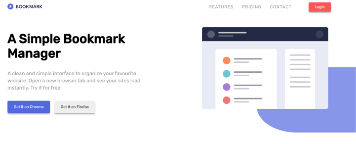

# Bookmark-landing-page

## Description 
It's a training project,
This project was made independently and without any starter code. It is made with HTML, CSS, SASS, BEM  and JavaScript.
The challenge is to build out this landing page and get it looking as close to the design as possible.
I could use any tools to help me complete the challenge. 
## General info
This landing based was coded based on the design by [Frontend Mentor](https://www.frontendmentor.io/challenges/bookmark-landing-page-5d0b588a9edda32581d29158)

## The challenge
For this challenge I had to:

- Create the rounded blue background shape with code
- Change the fill and stroke color of the SVGs at specific points (the challenge can be completed using the single logo-bookmark.svg file provided)
- View the optimal layout for the site depending on their device's screen size
- Traversing the DOM

### What left me to do is 
 email validation : 
*Receive an error message when the newsletter form is submitted if*:
- The input field is empty
- The email address is not formatted correctly

## Preview the website live on : [DEMO]( https://carolinafledgling.github.io/Bookmark-landing-page/)

## Screenshots

## Code Examples

Event interface's preventDefault():  `event.preventDefault()`  If an event is cancelable, the preventDefault method is used to signify that the event is to be canceled, meaning any default action normally taken by the implementation as a result of the event will not occur.Once preventDefault has been called it will remain in effect throughout the remainder of the event's propagation. This method may be used during any stage of event flow.

###👉 More info: [event.preventDefault()](https://developer.mozilla.org/en-US/docs/Web/API/Event/preventDefault)

